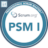
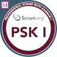
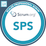
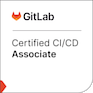
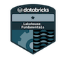

# Hi, I'm Fedir 👋

Welcome to my GitHub profile! I'm passionate about continuous learning, coding, and creativity. Here's a little more about me and what I do:

## 🎯 My Learning Progress
I am committed to expanding my knowledge and skills through various online platforms. You can check out my learning journey and progress on [Pluralsight](https://app.pluralsight.com/profile/fedir-tymoshchuk), [Udemy](https://www.udemy.com/user/fedir-tymoshchuk/), and [FreeCodeCamp](https://www.freecodecamp.org/FedirT).

## 🎨 My Artworks
Apart from coding, I love expressing myself through art. Feel free to explore my [artworks](https://ftymoshchuk.gitlab.io/art-page/public/), where I showcase my creative side.

## 🗺️ My Apps and Projects
I enjoy developing applications and working on personal projects. You can find my published apps on [Apple's App Store](https://apps.apple.com/us/developer/fedir-tymoshchuk/id1527457002) and explore my experimental [project](https://experimental-python-nature.azurewebsites.net) ([short link](https://shorturl.at/y5LmM)).

## 🦊 Connect with Me on GitLab
I also maintain a presence on GitLab. Check out my repositories and contributions [here](https://gitlab.com/ftymoshchuk).

## 📦 My Contributions to the Python Community
I have published several packages on PyPI. Visit my [pip page](https://pypi.org/user/fedirek/) to see my contributions.

# My [Leetcode](https://leetcode.com/u/fedirek/) Profile
Here is a snapshot of my Leetcode profile, showcasing my problem-solving skills and progress:

# My Certifications

## Agile
I am certified in various Agile methodologies:
| [PSM](https://www.credly.com/badges/afe10666-81f1-46b0-9dcb-6ea7f93c656b/public_url) | [PSK](https://www.credly.com/badges/944ee8d5-6994-492d-9a23-732cca9918e4/public_url) | [SPS](https://www.credly.com/badges/6ee7570d-37e8-42c7-8494-3eb525d1c4b3/public_url) |
| :----: | :----: | :---: |
|  |  | |

## GitLab
I have achieved the following GitLab certifications:
| [Git Associate](https://www.credly.com/badges/d0aa978a-44ba-4bd5-91d5-a43469ef3d2a/public_url) | [CI/CD Associate](https://www.credly.com/badges/5b6236a2-2159-4417-b20f-96363e0aa212/public_url) |
| :----:| :----:|
|  |  |

## Azure
I hold several Microsoft Azure certifications:
|[SC-900](https://learn.microsoft.com/api/credentials/share/en-us/FedirTymoshchuk-3741/85E19DD8E6E0C0E2?sharingId=98FBD8F94B8F8437)| [AI-900](https://learn.microsoft.com/api/credentials/share/en-us/FedirTymoshchuk-3741/25B9AFA440DD838A?sharingId=98FBD8F94B8F8437) | [DP-900](https://learn.microsoft.com/api/credentials/share/en-us/FedirTymoshchuk-3741/EA77A7D2A86E9ACB?sharingId=98FBD8F94B8F8437) | [SC-900](https://learn.microsoft.com/api/credentials/share/en-us/FedirTymoshchuk-3741/2C32EDE76F871C6B?sharingId=98FBD8F94B8F8437)
| :----:| :----:| :----:| :----:|
| |  |  |  |

## Cloud
I am certified by Databricks:
|[Databricks](https://credentials.databricks.com/a7078afe-28b3-4a25-b37e-5f78a08e74b3)|
| :----:|
|  |

### Big Thank You
Special thanks to [JacobLinCool](https://github.com/JacobLinCool/LeetCode-Stats-Card) for the awesome Leetcode Stats Card.

### Legacy Projects
Check out my older projects and solved programming challenges:
🐝 [Project](https://the-green-ways.gitlab.io/swollen/index.html)
Programmatic activities on 🏔 [Leetcode](https://leetcode.com/fedirek/) / [Hackerrank](https://www.hackerrank.com/ftymoshchuk)
🖼 [Old Page](https://tymoshchuk.weebly.com/)
